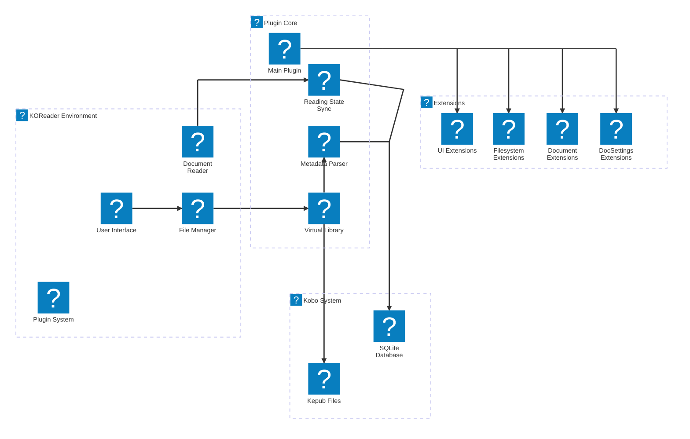

# High-Level Architecture

This chapter contains the visual overviews and high-level component relationships.

## Architecture

```mermaid
architecture-beta
    group koreader(mdi:laptop)[KOReader Environment]
        service ui(mdi:palette)[User Interface] in koreader
        service fm(mdi:folder-open)[File Manager] in koreader
        service dr(mdi:book-open-page-variant)[Document Reader] in koreader
        service ps(mdi:puzzle)[Plugin System] in koreader
    
    group plugin_core(mdi:cog)[Plugin Core]
        service mp(mdi:play-circle)[Main Plugin] in plugin_core
        service vl(mdi:library)[Virtual Library] in plugin_core
        service rss(mdi:sync)[Reading State Sync] in plugin_core
        service meta(mdi:tag-multiple)[Metadata Parser] in plugin_core
    
    group extensions(mdi:sitemap)[Extensions]
        service uie(mdi:palette-advanced)[UI Extensions] in extensions
        service fse(mdi:folder-network)[Filesystem Extensions] in extensions
        service dce(mdi:file-document)[Document Extensions] in extensions
        service dse(mdi:cog-box)[DocSettings Extensions] in extensions
    
    group kobo_system(mdi:harddisk)[Kobo System]
        service db(mdi:database)[SQLite Database] in kobo_system
        service kf(mdi:book-open-blank-variant)[Kepub Files] in kobo_system

    junction toDB
    junction toRSS

    junction extA
    junction extB
    junction extC
    junction extD
    junction extE

    ui:R --> L:fm
    fm:R --> L:vl
    vl:T --> B:meta
    meta:R -- L:toDB
    toDB:B --> T:db

    vl:B --> T:kf

    dr:T -- B:toRSS
    toRSS:R --> L:rss

    rss:R -- T:toDB

    mp:R -- L:extA
    extA:R -- L:extB
    extB:R -- L:extC
    extC:R -- L:extD
    extD:R -- L:extE

    extB:B --> T:uie
    extC:B --> T:fse
    extD:B --> T:dce
    extE:B --> T:dse
```
