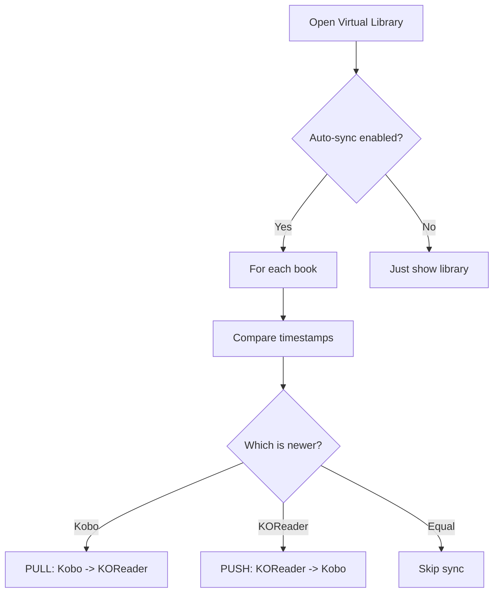
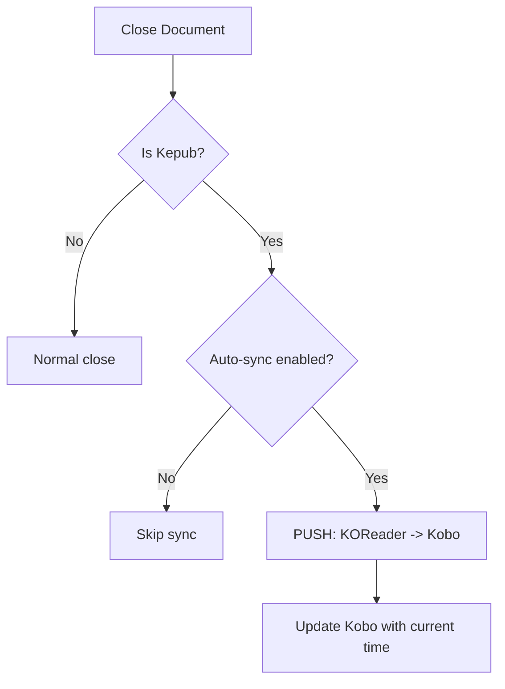
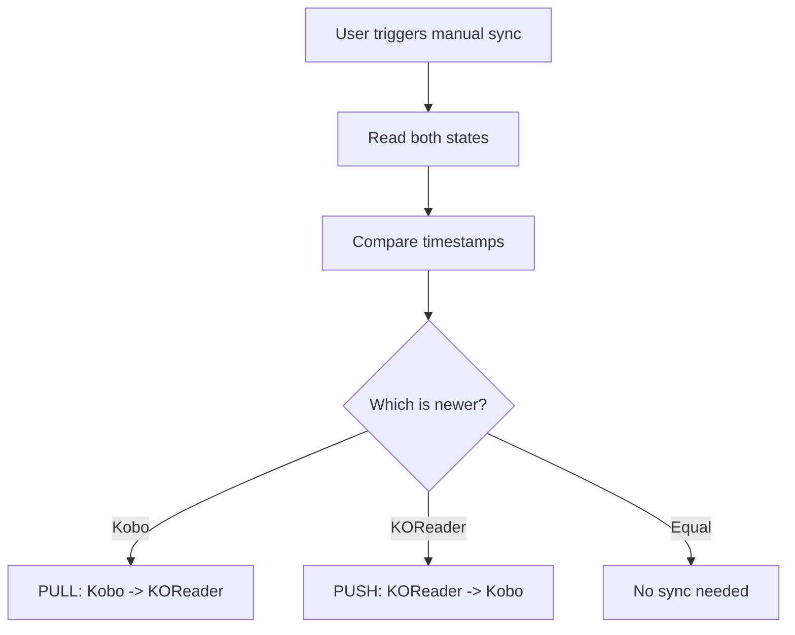
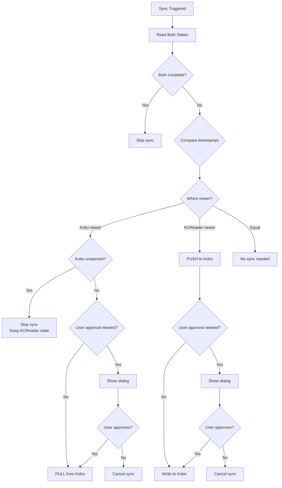
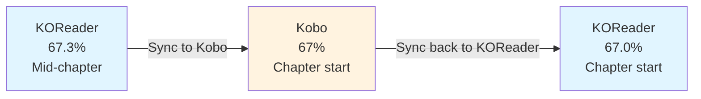

# Sync Decision Logic

This document explains how the plugin decides when to sync, in which direction, and how conflicts are resolved.

## Sync Triggers

The plugin performs sync operations at specific times:

### 1. Virtual Library Access (Auto-sync)


### 2. Document Close


### 3. Manual Sync


## Timestamp Comparison

The core of sync decision-making is comparing timestamps:

```lua
function syncBidirectional(book_id, doc_settings)
    -- Read both states
    local kobo_state = readKoboState(book_id)
    local kr_percent = doc_settings:readSetting("percent_finished") or 0
    local kr_timestamp = getValidatedKOReaderTimestamp(doc_path)
    
    -- Check if both sides are complete
    if areBothSidesComplete(kobo_state, kr_percent, kr_status) then
        return false  -- Skip sync
    end
    
    -- Compare timestamps
    if kobo_state.timestamp > kr_timestamp then
        -- Kobo is newer -> PULL
        return executePullFromKobo(book_id, doc_settings, kobo_state, kr_percent, kr_timestamp)
    end
    
    -- KOReader is newer (or equal) -> PUSH
    return executePushToKobo(book_id, doc_settings, kobo_state, kr_percent, kr_timestamp)
end
```

## Special Cases

### Both Sides Complete

If both systems show the book as finished, skip sync to avoid unnecessary writes:

```lua
function areBothSidesComplete(kobo_state, kr_percent, kr_status)
    local kobo_complete = (kobo_state.status == "complete") or 
                          (kobo_state.percent_read >= 100)
    
    local kr_complete = (kr_status == "complete") or 
                        (kr_status == "finished") or 
                        (kr_percent >= 1.0)
    
    return kobo_complete and kr_complete
end

-- Usage in sync logic
if areBothSidesComplete(kobo_state, kr_percent, kr_status) then
    logger.info("Both sides complete, skipping sync")
    return false
end
```

### Unopened Books (ReadStatus=0)

Books that have never been opened in Kobo's native reader need special handling:

```lua
-- When PULLING from Kobo
if kobo_state.kobo_status == 0 and kobo_state.percent_read == 0 then
    -- Book is unopened in Kobo, don't sync TO KOReader
    -- (Would overwrite KOReader progress with 0%)
    logger.info("Skipping sync for unopened book")
    return false
end

-- When PUSHING to Kobo
-- Always allow! This is how users start reading in KOReader first
```

This asymmetry is important:
- **PULL**: Don't overwrite KOReader progress with Kobo's 0%
- **PUSH**: Always allow KOReader to update Kobo (user may have started in KOReader)

### Missing Sidecar File

If a book has ReadHistory but no sidecar file, the ReadHistory timestamp is considered unreliable:

```lua
function getValidatedKOReaderTimestamp(doc_path)
    local kr_timestamp = getKOReaderTimestampFromHistory(doc_path)
    
    if kr_timestamp == 0 then
        return 0
    end
    
    -- Check if sidecar file exists
    local has_sidecar = DocSettings:hasSidecarFile(doc_path)
    
    if not has_sidecar then
        -- No sidecar = book never actually read in KOReader
        -- ReadHistory might be from just opening/previewing
        logger.dbg("No sidecar file found - ignoring ReadHistory timestamp")
        return 0
    end
    
    -- Sidecar exists, return the ReadHistory timestamp
    return kr_timestamp
end
```

This ensures that if KOReader has no actual reading progress data, Kobo's timestamp will be considered newer (or equal), triggering a PULL from Kobo.

## User Approval Dialogs

Depending on settings, the plugin may prompt the user before syncing:

```lua
function syncIfApproved(from_kobo, to_kobo, sync_callback, sync_details)
    -- Check if user wants a prompt for this direction
    local needs_approval = false
    
    if from_kobo and self.settings.from_kobo_prompt then
        needs_approval = true
    end
    
    if to_kobo and self.settings.to_kobo_prompt then
        needs_approval = true
    end
    
    if needs_approval then
        -- Show dialog with details
        showSyncDialog(sync_details, function(approved)
            if approved then
                sync_callback()
            end
        end)
    else
        -- Silent sync
        sync_callback()
    end
end
```

## Conflict Resolution Flow



## Why Chapter Boundaries?

When syncing TO Kobo, the position is rounded to chapter boundaries. This is a **technical limitation**, not a design choice.

### The Problem

KOReader tracks position as:
```lua
percent_finished = 0.673  -- 67.3% through the book
```

Kobo tracks position as:
```lua
ChapterIDBookmarked = "chapter2.html#kobo.3.5"
-- Where "3.5" are coordinates (format unknown, possibly HTML-based)
```

**The coordinate format is unknown**. While KOReader tracks its own position data:
- Overall percentage (0.0 to 1.0)
- Current page in the document
- Internal positioning information

There is no known way to convert this into the `x.y` coordinate format that Kobo uses.

### The Solution

The plugin:
1. Calculates which chapter contains the 67.3% position
2. Finds that chapter in Kobo's database using SQL
3. Sets the bookmark to the **start** of that chapter

```lua
function findChapterForPercentage(conn, book_id, percent_read)
    -- Use SQL to find the chapter that starts at or before the target position
    -- ___FileOffset is already the cumulative percentage (calculated by Kobo)
    local chapters_res = conn:exec(
        "SELECT ContentID, ___FileOffset, ___FileSize FROM content " ..
        "WHERE ContentID LIKE '" .. book_id .. "%' " ..
        "AND ContentType = 9 " ..
        "AND ___FileOffset <= " .. percent_read .. " " ..
        "ORDER BY ___FileOffset DESC LIMIT 1"
    )
    
    if chapters_res and chapters_res[1] and #chapters_res[1] > 0 then
        local chapter_id = chapters_res[1][1]
        local chapter_offset = chapters_res[2][1]
        local chapter_size = chapters_res[3][1]
        
        -- Calculate progress within this chapter
        local within_chapter = percent_read - chapter_offset
        local chapter_percent = (within_chapter / chapter_size) * 100
        
        -- Return the chapter bookmark
        return chapter_id .. "#kobo.1.1"  -- Start of chapter (default coordinate)
    end
end
```

### Why Not Calculate the Coordinates?

1. **Format unknown**: The exact meaning and calculation of the `x.y` coordinate format used by Kobo is not documented or known
2. **No conversion method**: There is no known way to map KOReader's position data to Kobo's coordinate system
3. **Chapter-level fallback**: Using `#kobo.1.1` (start of chapter) is the safe default
4. **Progress still tracked**: The chapter's `___PercentRead` field stores within-chapter progress percentage

### The Result



## Full Sync Decision Pseudocode

```lua
function syncBidirectional(book_id, doc_settings)
    -- 1. Read states
    local kobo_state = readKoboState(book_id)
    local kr_percent = doc_settings:readSetting("percent_finished") or 0
    local kr_timestamp = getValidatedKOReaderTimestamp(doc_path)
    local kr_status = doc_settings:readSetting("summary").status
    
    -- 2. Check if both complete
    if areBothSidesComplete(kobo_state, kr_percent, kr_status) then
        return false  -- Skip sync
    end
    
    -- 3. Compare timestamps
    if kobo_state.timestamp > kr_timestamp then
        -- Kobo is newer -> PULL
        return executePullFromKobo(book_id, doc_settings, kobo_state, kr_percent, kr_timestamp)
    end
    
    -- KOReader is newer or equal -> PUSH
    return executePushToKobo(book_id, doc_settings, kobo_state, kr_percent, kr_timestamp)
end
```

## Configuration Options

Users can control sync behavior through settings:

| Setting | Purpose | Default |
|---------|---------|---------|
| `sync_enabled` | Enable/disable all sync | ON |
| `auto_sync_enabled` | Auto-sync on library access | ON |
| `from_kobo_enabled` | Allow PULL from Kobo | ON |
| `to_kobo_enabled` | Allow PUSH to Kobo | ON |
| `from_kobo_prompt` | Prompt before PULL | SILENT |
| `to_kobo_prompt` | Prompt before PUSH | SILENT |

These settings create different sync strategies:
- **Kobo → KOReader only**: Disable `to_kobo_enabled`
- **KOReader → Kobo only**: Disable `from_kobo_enabled`
- **Manual control**: Enable prompts for both directions
- **Fully automatic**: Disable all prompts (recommended)

See [Settings Documentation](../../settings.md) for details.
