# Progress Storage in Kobo Database

This document explains how reading progress is stored and calculated in the Kobo database.

## Book vs Chapter Entries

Each book has:
- **One ContentType=6 entry**: The main book record with overall metadata
- **Multiple ContentType=9 entries**: One for each chapter


## Progress Calculation

Progress is calculated based on **percentage ranges** of chapters:

```lua
-- ___FileOffset = cumulative percentage where chapter starts (stored by Kobo)
-- ___FileSize = percentage size of the chapter
-- ___PercentRead (in chapter entry) = progress within this chapter (0-100)

-- To calculate overall progress, the plugin uses ___FileOffset directly:
-- 1. Looks up the current chapter entry
-- 2. Gets ___FileOffset (where chapter starts)
-- 3. Adds current chapter contribution: (chapter_size * chapter_percent / 100)

-- Example calculation:
chapter_offset = current_chapter.___FileOffset  -- Where chapter starts
current_chapter_contribution = (current_chapter.___FileSize * current_chapter.___PercentRead) / 100
overall_percent = chapter_offset + current_chapter_contribution
```

Example:
```
Book: 3 chapters (ordered by ___FileOffset)
Chapter 1: ___FileOffset=0,  ___FileSize=30  (spans 0-30%)   [completed]
Chapter 2: ___FileOffset=30, ___FileSize=40  (spans 30-70%)  [reading at 50%]
Chapter 3: ___FileOffset=70, ___FileSize=30  (spans 70-100%) [not started]

Calculation:
- Completed chapters: 30% (Chapter 1)
- Current chapter: 40 * 0.5 = 20%
- Overall: 30 + 20 = 50%
```

**Important**: 
- `___FileOffset` and `___FileSize` are **percentage values**, not byte counts
- All chapter `___FileSize` values sum to 100

## Why Chapter Boundaries?

The plugin can only write progress at chapter boundaries because:

1. **Kobo's chapter structure**: Each chapter is a separate database row (ContentType=9)
2. **Bookmark format limitation**: The `ChapterIDBookmarked` format is `"chapter.html#kobo.x.y"` where `x.y` are some form of coordinates (assumed to be in the HTML document, but exact format is unknown)
3. **Coordinate mapping unknown**: There is no known way to convert KOReader's position data into the `x.y` format that Kobo uses
4. **Chapter-level precision**: The plugin defaults to `#kobo.1.1` (start of chapter) for all bookmarks

When syncing **to Kobo**, the plugin:
1. Finds the chapter that contains the target percentage
2. Sets `ChapterIDBookmarked` to that chapter's ID
3. Updates that chapter's `___PercentRead` to reflect position within the chapter
4. Updates the main book entry's `___PercentRead` to the overall percentage

```mermaid
graph LR
    A[KOReader Position<br/>67.3%] --> B[Find Chapter<br/>Chapter with ___FileOffset ≤ 67]
    B --> C[Found: Chapter 3<br/>___FileOffset=60, ___FileSize=20]
    C --> D[Calculate within-chapter %<br/>67 - 60 / 20 = 35%]
    D --> E[Update Chapter 3<br/>___PercentRead = 35]
    E --> F[Update Book Entry<br/>___PercentRead = 67]
    F --> G[Set Bookmark<br/>ChapterIDBookmarked = chapter3.html#kobo.1.1]
```


