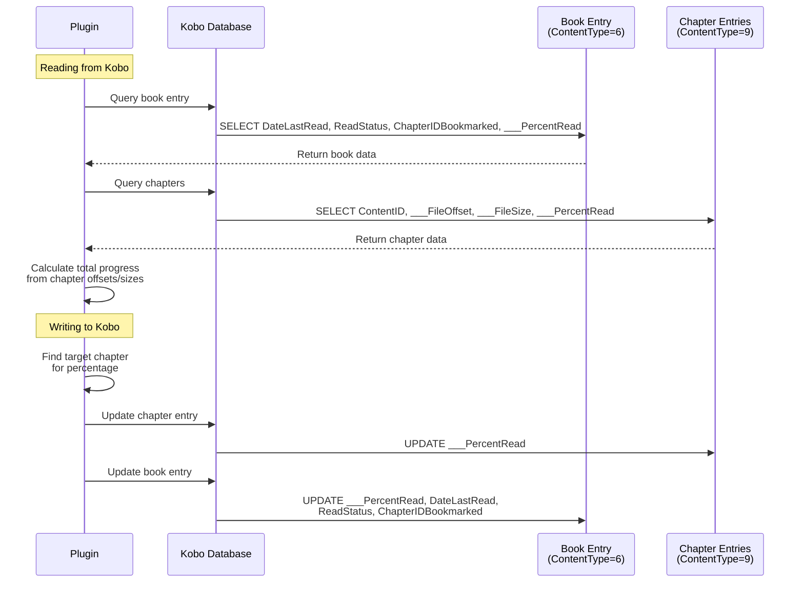

# Database Queries

This document lists all SQL queries used by the plugin to interact with the Kobo database.

## Reading Progress (Pull from Kobo)

```sql
-- Main book query
SELECT DateLastRead, ReadStatus, ChapterIDBookmarked, ___PercentRead
FROM content
WHERE ContentID = ? AND ContentType = 6
LIMIT 1

-- Chapter lookup (to calculate exact progress using ___FileOffset directly)
SELECT ContentID, ___FileOffset, ___FileSize, ___PercentRead
FROM content
WHERE ContentID LIKE '?%' AND ContentType = 9
  AND (ContentID LIKE '%?' OR ContentID LIKE '%?#%')
LIMIT 1
```

## Writing Progress (Push to Kobo)

```sql
-- Find target chapter using ___FileOffset
SELECT ContentID, ___FileOffset, ___FileSize
FROM content
WHERE ContentID LIKE '?%' AND ContentType = 9
  AND ___FileOffset <= ?
ORDER BY ___FileOffset DESC
LIMIT 1

-- Fallback: Get last chapter (if position is beyond all chapters)
SELECT ContentID
FROM content
WHERE ContentID LIKE '?%' AND ContentType = 9
ORDER BY ___FileOffset DESC
LIMIT 1

-- Update main book entry
UPDATE content
SET ___PercentRead = ?,
    DateLastRead = ?,
    ReadStatus = ?,
    ChapterIDBookmarked = ?
WHERE ContentID = ? AND ContentType = 6

-- Update current chapter entry
UPDATE content
SET ___PercentRead = ?
WHERE ContentID = ? AND ContentType = 9
```

## Data Flow Diagram


