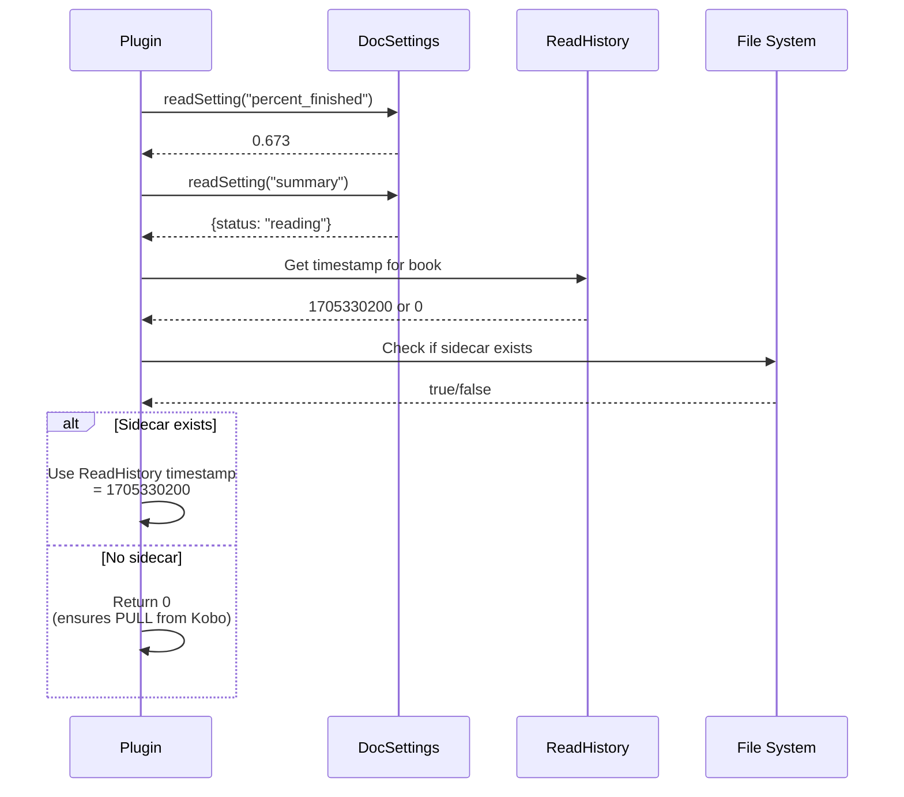
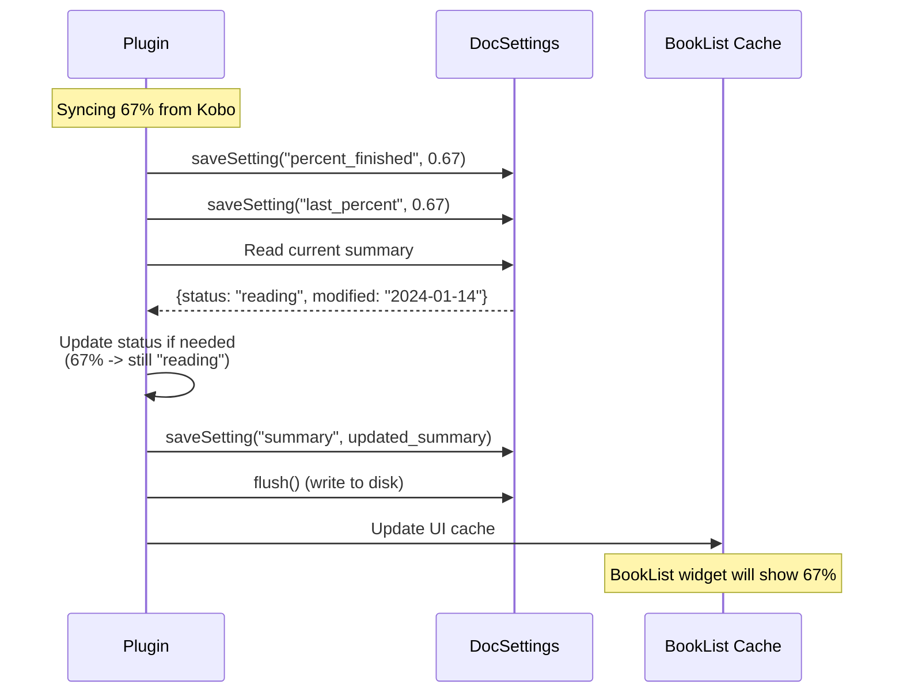
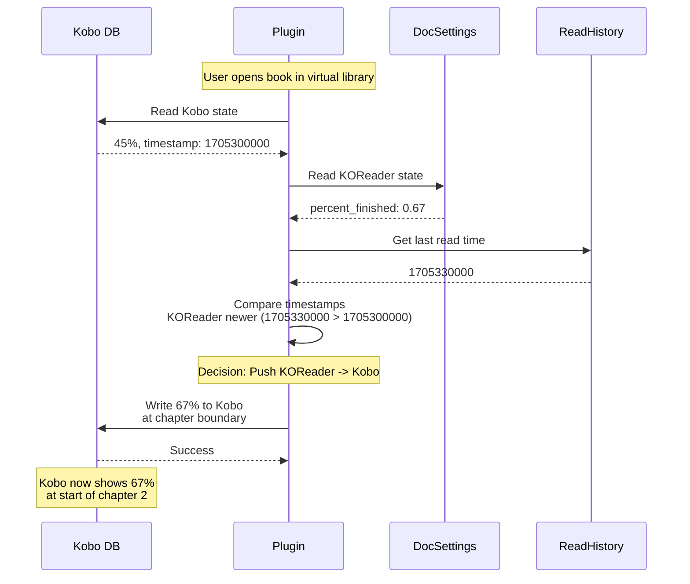

# Data Flow and Status Mapping

This document shows how data flows between the plugin and KOReader, and how status values are
converted.

## Data Flow: Reading from KOReader



## Data Flow: Writing to KOReader



## Status Mapping

KOReader and Kobo use different status values:

| KOReader     | Kobo ReadStatus | Meaning                |
| ------------ | --------------- | ---------------------- |
| `"reading"`  | `1`             | In progress            |
| `"complete"` | `2`             | Finished               |
| `"finished"` | `2`             | Finished (alternative) |
| (not set)    | `0`             | Unopened               |

```lua
-- Converting Kobo -> KOReader
function StatusConverter.koboToKoreader(kobo_status)
    if kobo_status == 0 then return nil end        -- Unopened
    if kobo_status == 2 then return "complete" end -- Finished
    return "reading"                                -- 1 or 3
end

-- Converting KOReader -> Kobo
function StatusConverter.koreaderToKobo(kr_status)
    if kr_status == "complete" or kr_status == "finished" then
        return 2  -- Finished
    end
    return 1  -- Reading
end
```

## Example: Complete Sync Flow


