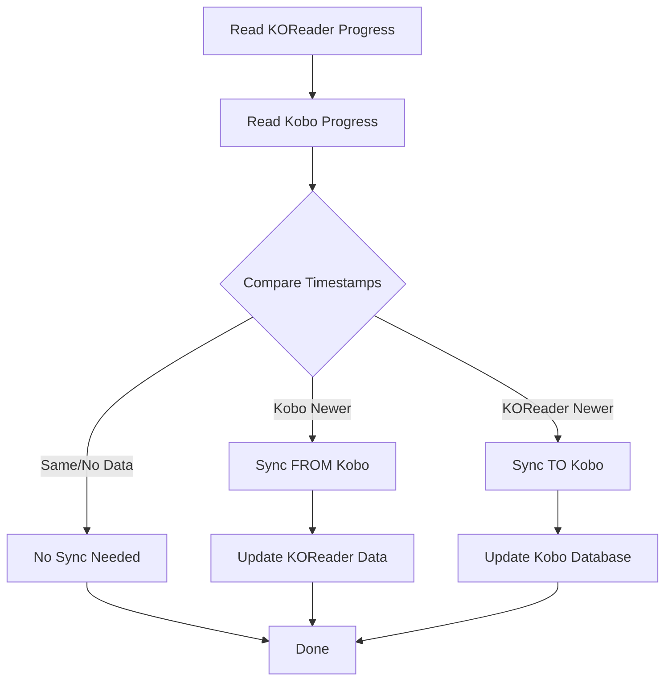
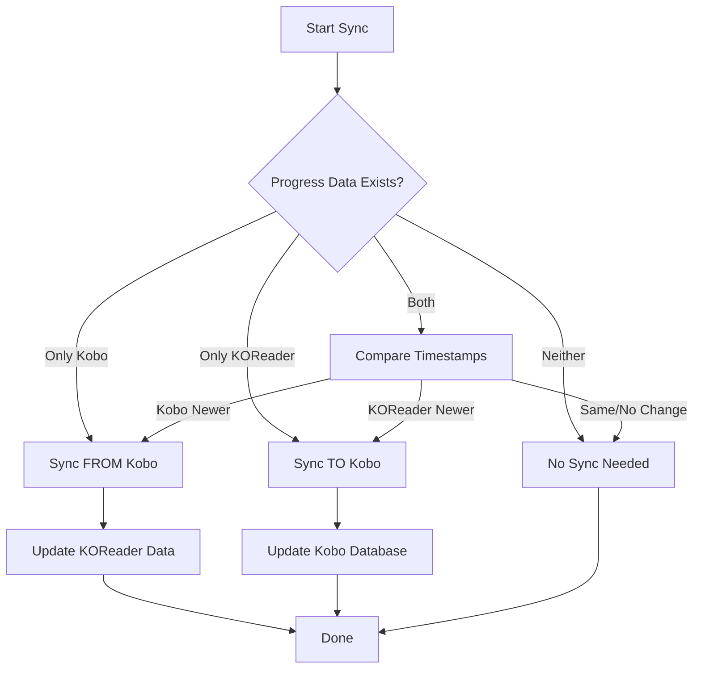
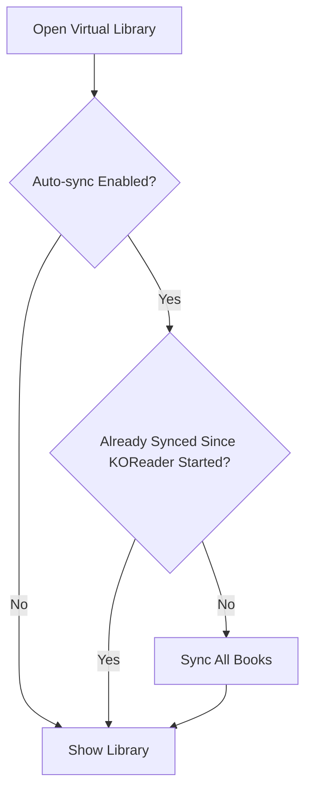
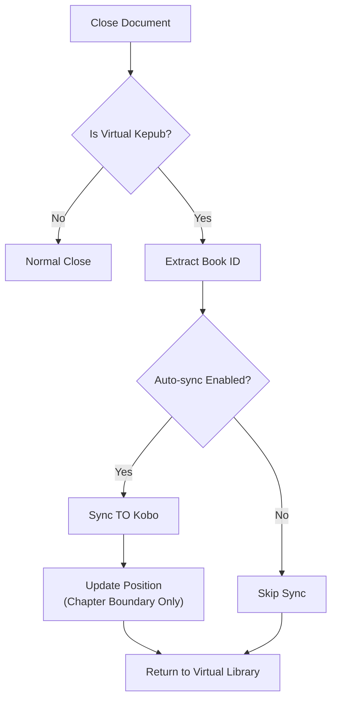

# Reading State Sync

The Reading State Sync feature maintains consistent reading progress between KOReader and Kobo's native reader by synchronizing position, completion status, and reading statistics.

**Note:** When syncing to Kobo, reading position is updated only at chapter boundaries. Fine-grained position within a chapter is not preserved.

## Overview

Reading State Sync works by:
1. **Monitoring reading progress** in both KOReader and Kobo
2. **Comparing timestamps** to determine the most recent reading session
3. **Syncing progress and status** in the appropriate direction

## How Sync Works

### Bidirectional Synchronization
The plugin supports sync in both directions:

#### FROM Kobo TO KOReader (Pull)
- Retrieves progress from Kobo's database
- Updates KOReader's document settings
- Preserves reading position and completion status

#### FROM KOReader TO Kobo (Push)
- Reads KOReader's progress from sidecar files
- Writes to Kobo's SQLite database
- Updates reading statistics in Kobo

### Timestamp-Based Sync Decision

## Sync Decision Flowchart

## Data Sources

### KOReader Data
Reading progress is stored in `.sdr` sidecar files managed by KOReader.

### Kobo Data
Progress is read from the `KoboReader.sqlite` database used by the Kobo system.

## Automatic Sync Triggers

### Library Access

## Document Close

**Important Limitation**: When syncing progress to Kobo, the position is updated only at chapter boundaries. Fine-grained position within a chapter is not preserved by Kobo's native reader.

However, when Kobo syncs progress back to KOReader, KOReader opens the book at the exact percentage received from Kobo, providing fine-grained positioning.