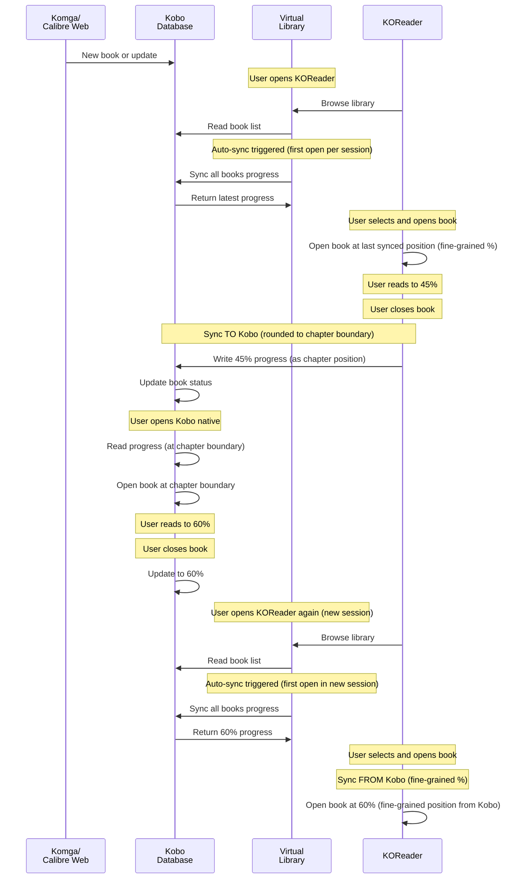

# Sync Flow Diagram

**Note**: This diagram assumes the recommended settings are enabled (auto-sync ON).

**Important Limitation**: When syncing to Kobo, position is rounded to chapter boundaries. When Kobo syncs back to KOReader, KOReader opens at the exact percentage from Kobo.

This diagram shows the complete flow of how books and reading progress move through the system when using Komga or Calibre Web with the Kobo Plugin. The key points are:
- Books are always displayed in the virtual library (independent of sync setting)
- Reading **progress** syncs automatically when:
  - Accessing the virtual library (if auto-sync enabled) - syncs all books once per session
  - Closing a book - always syncs that book's progress to Kobo (rounded to chapter boundary)
- KOReader uses fine-grained percentages when opening books (from either app)
- Kobo uses chapter-based positioning when opening books
